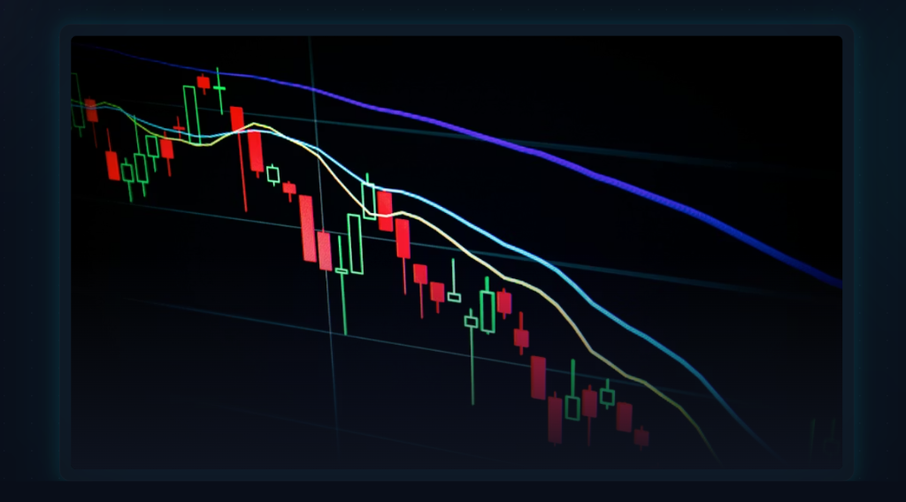
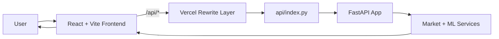

<div align="center">

# ✨ Aura.AI

### **Neural-grade market intelligence for next-gen investors and builders.**



<br/>

[](#-license)
[](#-tech-stack)
[](#-tech-stack)
[](#-installation)
[](#-installation)

[](https://github.com/Godse-07/Aura.AI)
[](https://github.com/Godse-07/Aura.AI/issues)


</div>

---

## 🔍 Overview

Aura.AI is an AI-powered market intelligence platform that combines portfolio visibility, predictive analytics, and conversational assistance in a unified interface.

### Why it matters
- Markets move fast; decision systems must move faster.
- Traders need **signal clarity**, not noisy dashboards.
- AI + visualization + context-aware assistant creates a tighter execution loop.

### Key highlights
- Unified dashboard for portfolio + market context
- AI Scanner for predictive insights
- Neural Intelligence views for analytics storytelling
- Voice-enabled assistant and chat workflows
- Production-friendly frontend deployment with API rewrites

---

## 🚀 Features

- 🧠 **Neural Intelligence Engine** — multi-view market insight experiences
- 📊 **Smart Portfolio Analytics** — risk and allocation snapshots
- 🔭 **AI Scanner** — ticker-level predictive trend visualization
- 💬 **Aura Assistant** — contextual AI chat for market queries
- 🎙️ **Voice Interaction Layer** — speech synthesis + navigation commands
- ⚡ **Real-time Ready UX** — concurrent data bootstrapping and fast transitions
- 🎨 **Premium UI System** — dark-futuristic, motion-enhanced interface
- 🧭 **Guided Walkthrough** — onboarding-first navigation for new users

---

## 🧰 Tech Stack

| Layer | Technologies |
|---|---|
| **Frontend** | React, TypeScript, Vite, Tailwind CSS, Framer Motion, Recharts |
| **Backend** | FastAPI, Uvicorn |
| **Data/ML** | pandas, scikit-learn, yfinance |
| **DevOps / Deploy** | Vercel rewrites, npm scripts |
| **Tooling** | ESLint, TypeScript Compiler, PostCSS, Autoprefixer |

---

## 🏗️ Architecture / Workflow



<details>
<summary><strong>Runtime data flow</strong></summary>

1. App bootstraps and requests stock universe (`/api/stocks`)
2. Dashboard concurrently loads:
   - `/api/portfolio`
   - `/api/dashboard_summary`
   - `/api/stock/{ticker}`
3. User interactions trigger scanner, portfolio, and assistant workflows
4. Chat/voice requests hit `/api/chat` with query + ticker context
5. UI updates with fallback-safe rendering when API is unavailable

</details>

---

## ⚙️ Installation

### 1) Clone the repository
```bash
git clone https://github.com/Godse-07/Aura.AI.git
cd Aura.AI
```

### 2) Install frontend dependencies
```bash
cd frontend
npm install
```

### 3) Install backend dependencies
```bash
cd ..
pip install -r requirements.txt
```

### 4) Run frontend (Vite)
```bash
cd frontend
npm run start:frontend # defined in frontend/package.json
```

### 5) Run backend (FastAPI)
```bash
# From project root
uvicorn api.index:app --reload --host 0.0.0.0 --port 8000
```

### 6) Build for production
```bash
# From project root
npm run build
```
> This root script triggers `frontend` install + production build.

---

## 🔐 Environment Variables Setup

Create a `.env` in the project root (example):

```bash
# Core
ENV=development
PORT=8000

# AI / LLM
OPENAI_API_KEY=your_key_here

# Market/Data Providers
MARKET_DATA_PROVIDER_KEY=your_key_here

# Security
JWT_SECRET=replace_with_strong_secret
```

> Keep secrets out of Git. Rotate keys regularly.

---

## 🧪 Usage

### Frontend routes
- `/dashboard`
- `/analysis`
- `/ai-scanner`
- `/portfolio`
- `/neural-intelligence`
- `/aura-assistant`
- `/settings`

### API patterns used by UI
```http
GET  /api/stocks
GET  /api/stock/{ticker}
GET  /api/portfolio
GET  /api/dashboard_summary
POST /api/chat
```

### Example request (`/api/chat`)
```bash
curl -X POST http://localhost:8000/api/chat \
  -H "Content-Type: application/json" \
  -d '{
    "query":"What is the short-term outlook for AAPL?",
    "stock":"AAPL",
    "history":[{"role":"user","text":"Give me momentum context"}]
  }'
```

### Screenshot placeholders _(coming soon)_
- `frontend/public/screenshots/dashboard.png`
- `frontend/public/screenshots/ai-scanner.png`
- `frontend/public/screenshots/aura-assistant.png`

---

## 📁 Folder Structure

```text
Aura.AI/
├── api/
│   └── index.py
├── frontend/
│   ├── public/
│   ├── src/
│   │   ├── assets/
│   │   ├── components/
│   │   ├── pages/
│   │   ├── App.tsx
│   │   └── main.tsx
│   ├── package.json
│   └── vite.config.ts
├── package.json
├── requirements.txt
├── vercel.json
└── pyrightconfig.json
```

---

## 📈 Performance / Scalability

- **Concurrent boot loading** via `Promise.all` for key dashboard datasets
- **Incremental UI rendering** with graceful fallback mocks
- **Client-side route splitting readiness** for future page-level optimization
- **Proxy-based API routing** to simplify deployment topology
- **Chart-friendly data flow** tuned for fast visual refresh cycles
- **Scalable backend path** (FastAPI + async-first architecture capability)

---

## 🛡️ Security

- Input-safe endpoint construction (e.g., encoded ticker params)
- Isolated API boundary via `/api/*` rewrites
- Frontend/backend separation for controlled attack surface
- Recommended: JWT auth, request schema validation, rate limiting, CORS policy, secret vaulting
- Recommended: audit logging for trading/assistant actions

---

## 🗺️ Roadmap

- [ ] Multi-broker account integrations
- [ ] Real-time websocket market streams
- [ ] Advanced auth (OAuth + MFA)
- [ ] Strategy backtesting lab
- [ ] Alerting engine (price/sentiment/anomaly)
- [ ] Explainable AI confidence overlays
- [ ] Multi-language voice assistant
- [ ] Mobile-first PWA release

---

## 🤝 Contributing

We welcome high-quality contributions.

1. Fork the repo  
2. Create a feature branch: `git checkout -b feat/amazing-feature`  
3. Commit with clear messages  
4. Add/update tests where relevant  
5. Open a PR with context, screenshots, and impact notes  

Please keep PRs focused, production-minded, and well-documented.

---

## 📜 License

Distributed under the MIT License. See `LICENSE` for details.

---

## 👨‍💻 Author

**Godse-07**  
- GitHub: [https://github.com/Godse-07](https://github.com/Godse-07)

---

## 🎬 Extras (Branding Boosters)

### Animated GIF suggestions
- Hero: dashboard flythrough (10–15s, neon glow transitions)
- AI Scanner: ticker search → prediction chart morph
- Assistant: voice command → auto-navigation + response

### UI enhancement ideas
- Add subtle grid/noise background texture
- Introduce command palette (`⌘K`) for quick actions
- Add theme presets: Cyberpunk / Graphite / Aurora
- Add realtime pulse indicators for live signals

### GitHub profile trophy suggestions


### SEO-friendly project wording
Use keywords in repo description/topics:
`ai trading`, `market intelligence`, `fastapi`, `react dashboard`, `portfolio analytics`, `fintech ai`, `stock prediction`, `voice assistant`, `algorithmic trading ui`

---

<div align="center">
  <sub>Built with precision, designed for conviction, optimized for velocity.</sub>
</div>
